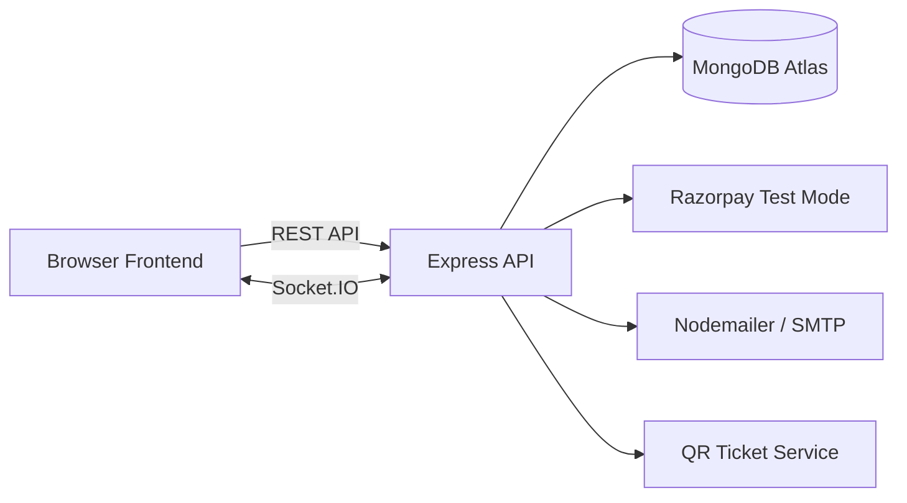

# SKYRA — Movie & Event Ticket Booking System

SKYRA is a full-stack movie and event ticket booking system built with a vanilla HTML/CSS/JavaScript frontend and a Node.js + Express + MongoDB backend.

The system supports:

- Customer, Organiser, and Admin roles
- JWT authentication and role-based access control
- Venue and physical seat-layout management
- Event and show management
- Per-show seat generation
- Temporary seat holds
- Concurrency protection
- Razorpay Test Mode payment flow
- Confirmed bookings
- QR ticket generation and ticket verification
- Email ticket delivery
- Cancellation and refund handling
- Waitlist and automatic seat offers
- Notifications
- Socket.IO real-time seat updates
- Admin dashboard and system management
- Organiser dashboard, booking summaries, and revenue reporting

## Demo Login Credentials

For project review and evaluation, SKYRA provides the following demo accounts:

| Role | Email | Password |
|---|---|---|
| Customer | `customer@skyra.com` | `Customer@1` |
| Organiser | `organizer@skyra.com` | `Organizer@1` |
| Admin | `admin@skyra.com` | `Admin@123` |

### Demo Email Limitation

These accounts are provided only for logging in and exploring SKYRA features. The demo email addresses are not real accessible inboxes, so **email delivery should not be tested with these demo accounts**.

When a demo account is used, reviewers should not expect to receive transactional emails such as:

- password-reset emails
- booking confirmation emails
- QR ticket emails
- cancellation or refund emails
- waitlist-related email messages

To test email delivery, use a SKYRA account registered with a **real accessible email address**. The Brevo/Nodemailer email integration can then deliver the corresponding transactional emails normally.

The demo accounts can still be used to test normal application functionality, including customer browsing and booking flows, organiser management features, admin features, role-based access control, in-application notifications, seat holds, waitlists, and Razorpay Test Mode.

## Technology Stack

### Frontend
- HTML5
- CSS3
- Vanilla JavaScript
- Socket.IO client
- Razorpay Checkout

### Backend
- Node.js
- Express.js
- MongoDB Atlas
- Mongoose
- JWT
- bcryptjs
- Socket.IO
- Nodemailer
- Razorpay SDK
- qrcode

## Main Roles

### CUSTOMER
Customers can browse events and shows, choose seats, hold seats, pay, receive bookings and QR tickets, cancel eligible bookings, join waitlists, receive offers, and view notifications.

### ORGANISER
Organisers can create and manage their own events and shows, generate show seats, and view booking/revenue information for their own inventory.

### ADMIN
Admins manage venues, seat categories, physical seat layouts, users, organisers, bookings, and system-level dashboard data.

## High-Level Architecture



## Core Seat Architecture

A physical venue seat is not the same as a show seat.

```text
Venue Seat
    ↓ copied when a show is generated
ShowSeat
    ↓
AVAILABLE
HELD
BOOKED
OFFERED
```

A `Venue Seat` describes the physical seat permanently stored under a venue.

A `ShowSeat` is the per-show instance used for availability, holds, booking, waitlist offers, and real-time updates.

## Booking Flow

```text
Customer
   ↓
Event
   ↓
Show
   ↓
ShowSeat
   ↓
Temporary Hold
   ↓
Razorpay Order
   ↓
Payment Verification
   ↓
Booking
   ↓
SeatHold = CONSUMED
   ↓
ShowSeat = BOOKED
   ↓
QR Ticket + Email
```

## Cancellation Flow

```text
Confirmed Booking
      ↓
Cancellation
      ↓
Refund request
      ↓
Booking = CANCELLED
      ↓
Seat released
      ↓
ShowSeat = AVAILABLE
      ↓
Waitlist processing
```

## Waitlist Flow

```text
Sold-out Category
      ↓
Customer joins waitlist
      ↓
Seat becomes available
      ↓
Automatic offer
      ↓
ShowSeat = OFFERED
      ↓
Customer claims offer
      ↓
Temporary SeatHold
      ↓
Checkout / Booking
```

## Real-Time Seat Updates

Socket.IO broadcasts seat-state changes to customers currently viewing the same show.

Examples:

```text
AVAILABLE → HELD
HELD      → AVAILABLE
HELD      → BOOKED
AVAILABLE → OFFERED
```

MongoDB remains the source of truth. Socket.IO is the real-time notification channel.

## Local Development

### Prerequisites

- Node.js
- npm
- MongoDB Atlas access
- Razorpay Test Mode credentials for payment testing
- Brevo SMTP credentials for transactional email testing

### 1. Obtain the Project

Clone or download the repository, then open a terminal in the project root.

```powershell
git clone <repository-url>
cd skyra-ticket-booking-system
```

### 2. Start the Backend

From the project root:

```powershell
cd backend
npm install
npm run dev
```

Default local backend URL:

```text
http://localhost:5000
```

### 3. Start the Frontend

Serve the `frontend` directory with Live Server or another static web server.

Typical local frontend URL:

```text
http://localhost:5500
```

The exact frontend port may differ depending on the static server being used.

## Environment Variables

Copy:

```text
.env.example
```

to:

```text
.env
```

and fill in the required values.

Never commit `.env`.

## Documentation

Detailed documentation is available in the `docs` folder:

- `architecture.md`
- `system-design.md`
- `database-schema.md`
- `api-documentation.md`
- `authentication-design.md`
- `seat-hold-design.md`
- `concurrency-design.md`
- `payment-design.md`
- `waitlist-design.md`
- `security.md`
- `testing.md`
- `deployment.md`

## Project Status

SKYRA has completed the planned implementation, testing, documentation, and deployment stages:

- Core implementation and integration: complete
- Full system testing: complete
- Documentation: complete
- Production-style deployment: complete

## Important Notes

- Razorpay is currently configured for **Test Mode**.
- MongoDB Atlas is used as the database.
- JWT tokens are required for protected routes.
- Role middleware prevents cross-role access.
- Secrets must remain only in environment variables.
