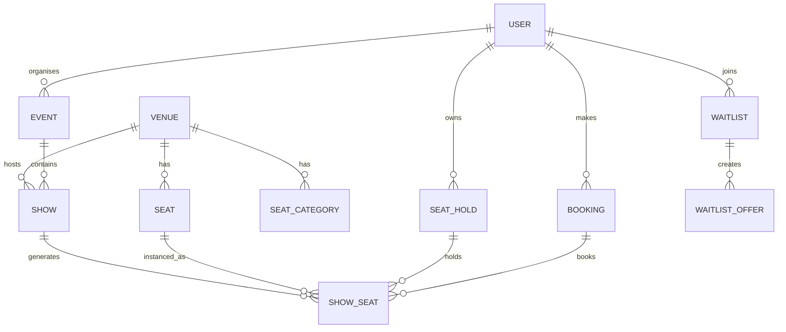

# SKYRA Database Schema

This document describes the major logical collections used by SKYRA.

Exact optional fields can evolve during implementation, but the relationships below represent the application design.

## 1. User

Important fields:

```text
_id
name
email
passwordHash
role
status
createdAt
updatedAt
```

Role values:

```text
CUSTOMER
ORGANISER
ADMIN
```

## 2. Venue

Important fields:

```text
_id
name
shortName
city
address
status
createdAt
updatedAt
```

Relationships:

```text
Venue 1 ─── * SeatCategory
Venue 1 ─── * Seat
Venue 1 ─── * Show
```

## 3. SeatCategory

Important fields:

```text
_id
venueId
name
defaultPrice
status
```

Examples:

```text
Premium
Standard
```

## 4. Seat

Physical venue seat.

Important fields:

```text
_id
venueId
categoryId
row
number
label
status
```

Example:

```text
B2
```

## 5. Event

Important fields:

```text
_id
organiserId
title
type
genre
language
duration
ageRating
posterUrl
bannerUrl
status
createdAt
updatedAt
```

## 6. Show

Important fields:

```text
_id
eventId
organiserId
venueId
startsAt
bookingClosesAt
status
capacity
```

## 7. ShowSeat

Per-show runtime seat.

Important fields:

```text
_id
showId
seatId
categoryId
label
price
status

heldByUserId
holdId

bookedByUserId
bookingId

offeredToUserId
offerId
```

Main status values:

```text
AVAILABLE
HELD
BOOKED
OFFERED
```

## 8. SeatHold

Important fields:

```text
_id
userId
showId
eventId
venueId
showSeatIds
status
createdAt
expiresAt
releasedAt
expiredAt
consumedAt
releaseReason
```

Main status values:

```text
ACTIVE
RELEASED
EXPIRED
CONSUMED
```

## 9. Payment

Important fields:

```text
_id
userId
holdId
razorpayOrderId
razorpayPaymentId
amountPaise
grandTotal
status
refundStatus
refundId
createdAt
updatedAt
```

Payment status includes:

```text
VERIFIED
```

Refund states may include:

```text
PENDING
REFUNDED
FAILED
```

## 10. Booking

Important fields:

```text
_id
reference
userId
showId
eventId
venueId
holdId
paymentId
seats
subtotal
convenienceFee
grandTotal
status
qrPayload
cancelledAt
cancellationReason
refundStatus
refundAmount
refundId
createdAt
updatedAt
```

Booking status includes:

```text
CONFIRMED
CANCELLED
```

## 11. Waitlist

Important fields:

```text
_id
userId
showId
eventId
venueId
categoryId
categoryName
status
joinedAt
activeOfferId
offeredAt
claimedAt
expiredAt
leftAt
```

Main status values:

```text
WAITING
OFFERED
CLAIMED
EXPIRED
LEFT
```

## 12. WaitlistOffer

Important fields:

```text
_id
waitlistId
userId
showId
eventId
venueId
categoryId
categoryName
showSeatId
seatLabel
price
status
offeredAt
expiresAt
claimedAt
expiredAt
cancelledAt
holdId
bookingId
requeuedAt
```

Main status values:

```text
ACTIVE
CLAIMED
EXPIRED
CANCELLED
```

## 13. Notification

Important fields:

```text
_id
userId
type
title
message
isRead
metadata
createdAt
updatedAt
```

## Relationship Summary


