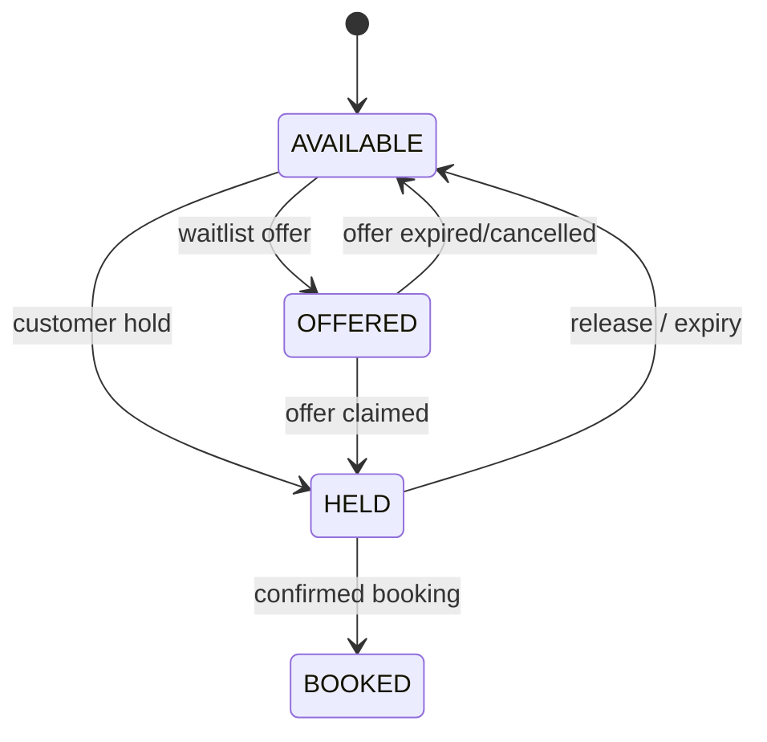

# SKYRA System Design

## 1. Functional Areas

SKYRA is divided into three role-oriented application areas.

### Customer
- browse events
- select show
- view visual seat map
- temporarily hold seats
- checkout
- pay
- create booking
- receive QR ticket
- receive booking email
- cancel eligible booking
- join waitlist
- claim waitlist offer
- view notifications

### Organiser
- create event
- manage events
- create show
- manage shows
- generate ShowSeats
- view own bookings
- view own revenue

### Admin
- manage venues
- manage seat categories
- manage physical seat layout
- manage users
- manage organisers
- review bookings
- view system dashboard

## 2. Domain Flow

### Venue Configuration

```text
Admin
 ↓
Venue
 ↓
Seat Categories
 ↓
Physical Seat Layout
```

### Event/Show Configuration

```text
Organiser
 ↓
Event
 ↓
Show
 ↓
Generate ShowSeats from venue layout
```

### Customer Booking

```text
Customer
 ↓
Event
 ↓
Show
 ↓
ShowSeats
 ↓
Hold
 ↓
Payment
 ↓
Booking
```

## 3. ShowSeat State Machine



## 4. Booking Consistency

A booking is created only after the backend verifies:

- authenticated customer
- active hold belongs to customer
- hold is not expired
- all ShowSeats still belong to the hold
- payment has been successfully verified
- booking has not already been created for the same transaction

After booking:

```text
Payment -> VERIFIED
SeatHold -> CONSUMED
ShowSeat -> BOOKED
Booking -> CONFIRMED
```

## 5. Cancellation Consistency

On cancellation:

```text
Booking -> CANCELLED
Payment -> refund process
ShowSeat -> AVAILABLE
```

If the released category has a waitlist, automatic offer logic can allocate the newly available seat.

## 6. Waitlist Offer Design

Only users waiting for the appropriate show/category are eligible.

The first eligible waiter receives a time-limited offer.

```text
Waitlist = OFFERED
WaitlistOffer = ACTIVE
ShowSeat = OFFERED
```

If claimed:

```text
Waitlist = CLAIMED
WaitlistOffer = CLAIMED
ShowSeat = HELD
SeatHold = ACTIVE
```

If expired, the offer can move to the next eligible waiter.

## 7. Real-Time Design

Every successful state-changing seat operation can emit a Socket.IO event.

Clients update the seat map without refreshing.

This avoids stale visual availability while still keeping MongoDB authoritative.
